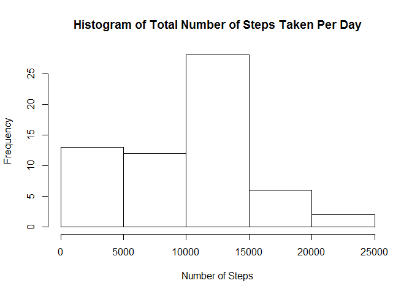

# Reproducible Research: Peer Assessment 1


## Loading and preprocessing the data

```r
df <- read.csv("activity.csv")
```
For plotting purposes, it may be better to number the 17,568 5-minutes interval starting from 0005 on 1/10/12 into a range starting from 001 to 288 for each day.

## What is mean total number of steps taken per day?
Number of steps for each day are summed and used to plot the histogram


```r
Day <- numeric()
Day[1] <- sum(as.numeric(df$steps[(0*288+1):(1*288)]), na.rm = TRUE)
Day[2] <- sum(as.numeric(df$steps[(1*288+1):(2*288)]), na.rm = TRUE)
Day[3] <- sum(as.numeric(df$steps[(2*288+1):(3*288)]), na.rm = TRUE)
Day[4] <- sum(as.numeric(df$steps[(3*288+1):(4*288)]), na.rm = TRUE)
Day[5] <- sum(as.numeric(df$steps[(4*288+1):(5*288)]), na.rm = TRUE)
Day[6] <- sum(as.numeric(df$steps[(5*288+1):(6*288)]), na.rm = TRUE)
Day[7] <- sum(as.numeric(df$steps[(6*288+1):(7*288)]), na.rm = TRUE)
Day[8] <- sum(as.numeric(df$steps[(7*288+1):(8*288)]), na.rm = TRUE)
Day[9] <- sum(as.numeric(df$steps[(8*288+1):(9*288)]), na.rm = TRUE)
Day[10] <- sum(as.numeric(df$steps[(9*288+1):(10*288)]), na.rm = TRUE)
Day[11] <- sum(as.numeric(df$steps[(10*288+1):(11*288)]), na.rm = TRUE)
Day[12] <- sum(as.numeric(df$steps[(11*288+1):(12*288)]), na.rm = TRUE)
Day[13] <- sum(as.numeric(df$steps[(12*288+1):(13*288)]), na.rm = TRUE)
Day[14] <- sum(as.numeric(df$steps[(13*288+1):(14*288)]), na.rm = TRUE)
Day[15] <- sum(as.numeric(df$steps[(14*288+1):(15*288)]), na.rm = TRUE)
Day[16] <- sum(as.numeric(df$steps[(15*288+1):(16*288)]), na.rm = TRUE)
Day[17] <- sum(as.numeric(df$steps[(16*288+1):(17*288)]), na.rm = TRUE)
Day[18] <- sum(as.numeric(df$steps[(17*288+1):(18*288)]), na.rm = TRUE)
Day[19] <- sum(as.numeric(df$steps[(18*288+1):(19*288)]), na.rm = TRUE)
Day[20] <- sum(as.numeric(df$steps[(19*288+1):(20*288)]), na.rm = TRUE)
Day[21] <- sum(as.numeric(df$steps[(20*288+1):(21*288)]), na.rm = TRUE)
Day[22] <- sum(as.numeric(df$steps[(21*288+1):(22*288)]), na.rm = TRUE)
Day[23] <- sum(as.numeric(df$steps[(22*288+1):(23*288)]), na.rm = TRUE)
Day[24] <- sum(as.numeric(df$steps[(23*288+1):(24*288)]), na.rm = TRUE)
Day[25] <- sum(as.numeric(df$steps[(24*288+1):(25*288)]), na.rm = TRUE)
Day[26] <- sum(as.numeric(df$steps[(25*288+1):(26*288)]), na.rm = TRUE)
Day[27] <- sum(as.numeric(df$steps[(26*288+1):(27*288)]), na.rm = TRUE)
Day[28] <- sum(as.numeric(df$steps[(27*288+1):(28*288)]), na.rm = TRUE)
Day[29] <- sum(as.numeric(df$steps[(28*288+1):(29*288)]), na.rm = TRUE)
Day[30] <- sum(as.numeric(df$steps[(29*288+1):(30*288)]), na.rm = TRUE)
Day[31] <- sum(as.numeric(df$steps[(30*288+1):(31*288)]), na.rm = TRUE)
Day[32] <- sum(as.numeric(df$steps[(31*288+1):(32*288)]), na.rm = TRUE)
Day[33] <- sum(as.numeric(df$steps[(32*288+1):(33*288)]), na.rm = TRUE)
Day[34] <- sum(as.numeric(df$steps[(33*288+1):(34*288)]), na.rm = TRUE)
Day[35] <- sum(as.numeric(df$steps[(34*288+1):(35*288)]), na.rm = TRUE)
Day[36] <- sum(as.numeric(df$steps[(35*288+1):(36*288)]), na.rm = TRUE)
Day[37] <- sum(as.numeric(df$steps[(36*288+1):(37*288)]), na.rm = TRUE)
Day[38] <- sum(as.numeric(df$steps[(37*288+1):(38*288)]), na.rm = TRUE)
Day[39] <- sum(as.numeric(df$steps[(38*288+1):(39*288)]), na.rm = TRUE)
Day[40] <- sum(as.numeric(df$steps[(39*288+1):(40*288)]), na.rm = TRUE)
Day[41] <- sum(as.numeric(df$steps[(40*288+1):(41*288)]), na.rm = TRUE)
Day[42] <- sum(as.numeric(df$steps[(41*288+1):(42*288)]), na.rm = TRUE)
Day[43] <- sum(as.numeric(df$steps[(42*288+1):(43*288)]), na.rm = TRUE)
Day[44] <- sum(as.numeric(df$steps[(43*288+1):(44*288)]), na.rm = TRUE)
Day[45] <- sum(as.numeric(df$steps[(44*288+1):(45*288)]), na.rm = TRUE)
Day[46] <- sum(as.numeric(df$steps[(45*288+1):(46*288)]), na.rm = TRUE)
Day[47] <- sum(as.numeric(df$steps[(46*288+1):(47*288)]), na.rm = TRUE)
Day[48] <- sum(as.numeric(df$steps[(47*288+1):(48*288)]), na.rm = TRUE)
Day[49] <- sum(as.numeric(df$steps[(48*288+1):(49*288)]), na.rm = TRUE)
Day[50] <- sum(as.numeric(df$steps[(49*288+1):(50*288)]), na.rm = TRUE)
Day[51] <- sum(as.numeric(df$steps[(50*288+1):(51*288)]), na.rm = TRUE)
Day[52] <- sum(as.numeric(df$steps[(51*288+1):(52*288)]), na.rm = TRUE)
Day[53] <- sum(as.numeric(df$steps[(52*288+1):(53*288)]), na.rm = TRUE)
Day[54] <- sum(as.numeric(df$steps[(53*288+1):(54*288)]), na.rm = TRUE)
Day[55] <- sum(as.numeric(df$steps[(54*288+1):(55*288)]), na.rm = TRUE)
Day[56] <- sum(as.numeric(df$steps[(55*288+1):(56*288)]), na.rm = TRUE)
Day[57] <- sum(as.numeric(df$steps[(56*288+1):(57*288)]), na.rm = TRUE)
Day[58] <- sum(as.numeric(df$steps[(57*288+1):(58*288)]), na.rm = TRUE)
Day[59] <- sum(as.numeric(df$steps[(58*288+1):(59*288)]), na.rm = TRUE)
Day[60] <- sum(as.numeric(df$steps[(59*288+1):(60*288)]), na.rm = TRUE)
Day[61] <- sum(as.numeric(df$steps[(60*288+1):(61*288)]), na.rm = TRUE)

hist(Day, main = paste("Histogram of Total Number of Steps Taken Per Day"), xlab = "Number of Steps")
```

 

```r
mean(Day)
```

```
## [1] 9354.23
```

```r
median(Day)
```

```
## [1] 10395
```
The mean and median total number of steps taken per day are 9,354.23 and 10,395 respectively

## What is the average daily activity pattern?
Means number of steps for the same internal of each day, i.e., average number of steps @ 0005 hours for 1/10/12 to 30/11/12 are used for plotting
The means for 1st interval @ 0000 hour of each day is numbered as int[1], 2nd interval @ 0005 is numbered as int[2], so on and so forth.

```r
library(dplyr)
```

```
## 
## Attaching package: 'dplyr'
## 
## The following object is masked from 'package:stats':
## 
##     filter
## 
## The following objects are masked from 'package:base':
## 
##     intersect, setdiff, setequal, union
```

```r
T <- data.frame()
T <- filter(df, interval == 0)
S <- sum(as.numeric(T$steps), na.rm = TRUE)
A <- S/61
int <- numeric()
int[1] <- A

T <- filter(df, interval == 5)
S <- sum(as.numeric(T$steps), na.rm = TRUE)
A <- S/61
int[2] <- A
```

## Imputing missing values

## Are there differences in activity patterns between weekdays and weekends?
